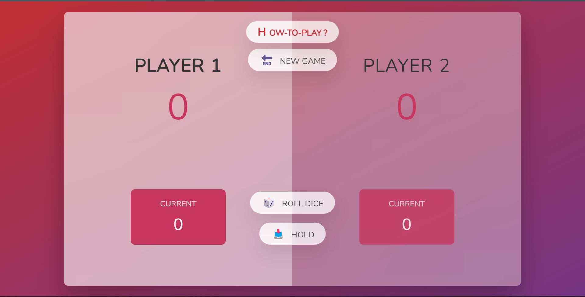

# Pig-Game 🎲

Pig Game is a dice game in which the first who scores 100 or more points, wins.It is developed using HTML, CSS, Javascript.

[Click Here](https://vivavishnu.github.io/Pig-Game/)

## Game Rules:

* The game has two players, playing in rounds.
* In each turn, a player rolls a dice as many times as he whishes. Each result get added to his round score.
* But if the player rolls a 1, all his round score gets lost. After that, it's the next player's turn.
* The player can choose to 'Hold', which means that his round score gets added to his global score. After that, it's the next player's turn.
* The first player to reach 100 points on global score wins the game.🎉
